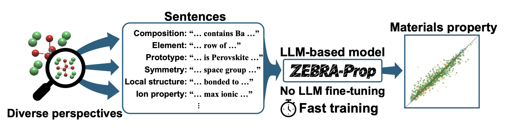

# ZEBRA-Prop (Zero-Shot Embedding-Based Rapid and Accessible Regression Model for Materials Properties)

## Overview



[Graphical Abstract (PDF)](docs/assets/Graphical_Abstract.pdf)

This repository contains:

1. **`zebra-prop`**: training and evaluation for material property prediction
2. **`zebra-tool-kit`**: preprocessing utilities for CIF, descriptors, and text descriptions

The dataset is maintained separately in the ZEBRA-dataset repository:

`https://github.com/oba-group/ZEBRA-dataset`

The default config in `config/config.yaml` points to `./ZEBRA-dataset/data`, so cloning the dataset alongside this repository is the expected setup for real runs.

## Installation

Python `3.10` to `3.13` is required.

```bash
uv sync
```

## Key Config Fields (Default)

The following defaults are loaded from `config/config.yaml`:

- `data_dir: ./ZEBRA-dataset/data`
- `output_dir: ./output`
- `property_name: band_gap`
- `task_name: sample`
- `hf_model_name: lfoppiano/MatTPUSciBERT`
- `max_length: 512`
- `epochs: 200`
- `bs: 16`
- `lr: 0.001`
- `num_of_fold: 5`
- `test_fold: 0`
- `seed: 42`
- `save_prediction_values: true`
- `save_parity_plot: true`

Description CSVs are expected at:

```text
{data_dir}/description/{task_name}/*.csv
```

## Component Roles

### 1) zebra-prop (main)

`zebra-prop` performs:

- input validation for required dataset layout
- multi-description text embedding with Hugging Face models
- k-fold split training with PyTorch Lightning + Hydra
- metric reporting (MAE/RMSE/R2), checkpoint saving, and optional prediction exports/parity plot

Core command:

```bash
uv run zebra-prop train
```

### 2) zebra-tool-kit (tooling)

`zebra-tool-kit` supports preprocessing before training:

- **featurize**: CIF -> matminer descriptor CSV
- **describe**: descriptor CSV -> `id,formula,description` CSV
- **gui**: drag-and-drop template studio (multi-CSV label extraction, random draft generation, export)

Examples:

```bash
# 1) CIF -> descriptor CSVs
uv run zebra-tool-kit featurize --data-dir ./ZEBRA-dataset/data --featurizer all

# 2) descriptor CSV -> description CSV
uv run zebra-tool-kit describe \
  --input-csv ./ZEBRA-dataset/data/descriptor/ElementProperty.csv \
  --output-csv ./ZEBRA-dataset/data/description/sample/ElementProperty.csv \
  --formula-simplified \
  --integerize \
  --template "{{formula}} has mean row {{PymatgenData mean row}}."

# 3) GUI template editor
uv run zebra-tool-kit gui --data-dir ./ZEBRA-dataset/data
```

## Quick Start

Run the bundled example data:

```bash
bash examples/quickstart_train.sh
```

Or run directly:

```bash
uv run zebra-prop train \
  data_dir=./examples/data \
  property_name=band_gap \
  task_name=sample \
  test_fold=0
```

## Tutorial: ZEBRA-dataset -> Describe -> Train

This is the standard flow for full dataset runs:

1) clone `ZEBRA-dataset`  
2) skip descriptor generation (descriptors are already included)  
3) generate description CSVs from descriptor CSVs  
4) train `zebra-prop` using generated descriptions

### 0) Clone dataset

```bash
git clone https://github.com/oba-group/ZEBRA-dataset.git
```

### 1) Descriptor step (skip)

`ZEBRA-dataset` already contains descriptor CSVs under:

```text
ZEBRA-dataset/data/descriptor/
```

So you can skip `zebra-tool-kit featurize` in this tutorial.

If you want to regenerate descriptors from CIF files, run:

```bash
uv run zebra-tool-kit featurize \
  --data-dir ./ZEBRA-dataset/data \
  --featurizer all
```

### 2) Generate description CSVs from all descriptor CSVs

```bash
mkdir -p ./ZEBRA-dataset/data/description/sample

for csv in ./ZEBRA-dataset/data/descriptor/*.csv; do
  uv run zebra-tool-kit describe \
    --input-csv "$csv" \
    --output-csv "./ZEBRA-dataset/data/description/sample/$(basename "$csv")" \
    --formula-simplified \
    --integerize
done
```

### 3) Train zebra-prop

With defaults in `config/config.yaml`:

```bash
uv run zebra-prop train
```

Or explicitly:

```bash
uv run zebra-prop train \
  data_dir=./ZEBRA-dataset/data \
  property_name=band_gap \
  task_name=sample \
  test_fold=0
```

### 4) Check outputs

```text
./output/checkpoints/...
./output/predictions/sample/MatTPUSciBERT/band_gap/fold0/
```

## Expected Data Format

`data_dir` must contain:

```text
{data_dir}/
├─ id_prop/id_prop_{property_name}.csv
└─ description/{task_name}/*.csv
```

Each description CSV must include `id,formula,description`.

Details: `docs/data_format.md`

## Output Artifacts

Main outputs include:

- checkpoint: `{output_dir}/checkpoints/...`
- predictions: `{output_dir}/predictions/{task_name}/{model_name}/{property_name}/fold{test_fold}/`
- optional files: `train_predictions.csv`, `valid_predictions.csv`, `test_predictions.csv`, `parity_plot.png`

Hydra also writes run metadata under `outputs/`, which is ignored by git.

## Citation

If you use this repository, cite:

```bibtex
@article{yamamoto2026zebraprop,
  title = {ZEBRA-Prop: A Zero-Shot Embedding-Based Rapid and Accessible Regression Model for Materials Properties},
  author = {Yamamoto, Ryoma and Takahashi, Akira and Terayama, Kei and Kumagai, Yu and Oba, Fumiyasu},
  journal = {arXiv},
  volume = {arXiv:2603.26060},
  year = {2026},
  doi = {10.48550/arXiv.2603.26060},
  url = {https://arxiv.org/abs/2603.26060}
}
```

If you use the preprocessing toolkit or the default encoder in your work, also cite the main upstream resources used by this repository:

### zebra-tool-kit dependencies

`zebra-tool-kit` relies primarily on `matminer` for descriptor generation and `pymatgen` for structure/composition handling.

```bibtex
@article{ward2018matminer,
  title = {Matminer: An open source toolkit for materials data mining},
  author = {Ward, Logan and Dunn, Alexander and Faghaninia, Alireza and Zimmermann, Nils E. R. and Bajaj, Sarbajit and Wang, Qi and Montoya, Joseph H. and Chen, Jiming and Bystrom, Kyle and Dylla, Maxwell and Chard, Kyle and Asta, Mark and Persson, Kristin and Snyder, G. Jeffrey and Foster, Ian and Jain, Anubhav},
  journal = {Computational Materials Science},
  volume = {152},
  pages = {60--69},
  year = {2018},
  doi = {10.1016/j.commatsci.2018.05.018}
}
```

```bibtex
@article{ong2013pymatgen,
  title = {Python Materials Genomics (pymatgen): A robust, open-source python library for materials analysis},
  author = {Ong, Shyue Ping and Richards, William Davidson and Jain, Anubhav and Hautier, Geoffroy and Kocher, Michael and Cholia, Shreyas and Gunter, Dan and Chevrier, Vincent and Persson, Kristin A. and Ceder, Gerbrand},
  journal = {Computational Materials Science},
  volume = {68},
  pages = {314--319},
  year = {2013},
  doi = {10.1016/j.commatsci.2012.10.028}
}
```

### Default encoder

The default `hf_model_name` is `lfoppiano/MatTPUSciBERT`.

- Model card: `https://huggingface.co/lfoppiano/MatTPUSciBERT`
